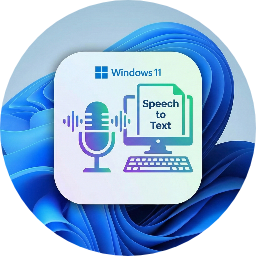

<div align="center">
  
  <h1 align="center">VoiceSync</h1>
  <p align="center">
    <strong>无需安装 App，手机语音实时同步至电脑光标</strong>
  </p>
  <p align="center">
    <a href="LICENSE">
      
    </a>
    <a href="https://www.python.org/">
      
    </a>
    <a href="../../releases">
      
    </a>
  </p>
</div>

## 📖 简介 | Introduction

**VoiceSync** 是一款轻量级的生产力工具，旨在打通手机语音输入与电脑文本编辑之间的壁垒。无需在手机上安装任何额外 App，只需运行电脑端客户端，手机扫描二维码即可将语音识别结果实时推送到电脑当前光标位置。

无论是撰写文档、代码注释还是即时聊天，VoiceSync 都能利用手机优秀的语音识别能力显著提升您的输入效率。

## ✨ 核心特性 | Features

- **📱 无需安装 App**: 直接使用手机浏览器或微信扫码即可开始输入，即用即走。
- **⚡ 实时同步**: 基于 WebSocket 的低延迟连接，语音转文字即刻上屏，体验流畅。
- **🎯 智能粘贴**: 
  - 自动识别当前焦点窗口类型。
  - **GUI 程序**: 模拟 `Ctrl+V` 粘贴。
  - **终端/控制台**: 模拟 `Ctrl+Shift+V` 粘贴，完美适配 VSCode Terminal、Windows Terminal 等。
- **🧠 语音优化**: 
  - 自动过滤语音输入中的语气词（如“那个”、“然后”、“嗯”、“啊”等）。
  - 智能纠正重复字词，确保同步到电脑的文本精炼准确。
- **🔄 窗口防错**: 智能检测窗口切换。如果输入过程中焦点窗口发生变化，会自动暂停同步并提示，防止文字发送到错误的应用程序。
- **🌐 多网卡适配**: 支持多网卡环境（如同时连接有线和无线），可手动选择正确的局域网 IP。
- **🚀 极简体验**: 提供单文件 exe 版本，支持最小化到系统托盘，后台静默运行。
- **🔄 自动更新**: 内置版本检测功能，一键获取最新功能和修复。

## 📥 下载安装 | Download & Install

### 方式一：下载可执行文件（推荐）

前往项目的 [Releases](../../releases) 页面下载最新版本：

| 文件名 | 说明 |
| :--- | :--- |
| **VoiceSync-Setup-x.x.x.exe** | **安装版**（推荐）。支持自动创建桌面快捷方式、开始菜单入口，含卸载程序。 |
| **VoiceSync.exe** | **便携版**。单文件绿色软件，下载即用，无需安装。 |

### 方式二：源码运行

如果您是开发者或习惯使用 Python 环境，可以源码运行：

1. **环境准备**: 确保已安装 Python 3.11 或更高版本。
2. **克隆仓库**:
   ```bash
   git clone https://github.com/chxcodepro/VoiceSync.git
   cd VoiceSync
   ```
3. **安装依赖**:
   ```bash
   pip install -r requirements.txt
   ```
4. **启动程序**:
   ```bash
   python server.py
   ```

## 🛠️ 使用指南 | User Guide

1. **启动**: 运行 `VoiceSync` 程序，确保电脑防火墙允许程序访问网络（首次运行可能会弹出提示）。
2. **连接**: 确保手机和电脑连接在**同一局域网**（Wi-Fi）。如果电脑有多个 IP，请在程序下拉框中选择正确的网段 IP。
3. **扫码**: 使用手机（微信、系统相机或浏览器）扫描程序界面显示的二维码。
4. **输入**: 手机端网页加载后，点击麦克风图标或直接使用输入法语音输入。
5. **同步**: 电脑端光标所在的输入框将实时显示您在手机上说出的文字。

> **小技巧**: 点击程序右上角的关闭按钮可以选择“最小化到托盘”，保持后台运行。

## 🏗️ 开发构建 | Development

如果您想参与开发或自行构建发行版：

```bash
# 1. 安装 PyInstaller
pip install pyinstaller

# 2. 执行构建命令
pyinstaller --onefile --windowed --name "VoiceSync" --icon icon.ico server.py
```
构建成功后，可执行文件将位于 `dist` 目录下。

## 🔧 技术栈 | Tech Stack

- **核心语言**: Python 3.11+
- **GUI 框架**: Tkinter (原生界面，轻量级)
- **网络通信**: 
  - `http.server`: 提供手机端静态页面
  - `websockets`: 实现端到端实时数据传输
- **系统交互**: 
  - `pyautogui` & `pyperclip`: 模拟键盘输入和剪贴板操作
  - `pystray`: 系统托盘图标支持
  - `psutil` & `pywin32`: 进程与窗口管理

## 📄 许可证 | License

本项目基于 [MIT License](LICENSE) 开源。

---
<div align="center">
  Made with ❤️ by chx
</div>